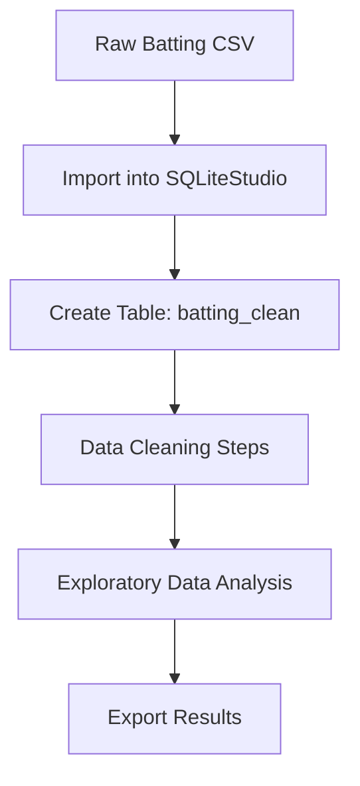

# ⚾ MLB Batting Stats — Data Cleaning & Analysis  
**Comprehensive baseball analytics using SQL, lookup tables, and exploratory data analysis**


## 📂 Data source
  
  - [View dataset MLB_batting_stats.csv](Dataset/MLB_Batting_stats) 
  
## 📝 Project Overview 
  
  This dataset from the **Kaggle** website contains scraped **Major League Baseball (MLB)** batting statistics from Baseball Reference for the seasons 2015 through 2024. It was collected using a custom Python scraping script and then cleaned and processed in SQL for use in analytics and machine learning workflows.
  
  The data provides a rich view of offensive player performance across a decade of MLB history. Each row represents a player’s season, with key batting metrics such as Batting Average *(BA)*, On-Base Percentage *(OBP)*, Slugging *(SLG)*, OPS, RBI, and Games Played *(G)*. This dataset is ideal for sports analytics, predictive modeling, and trend analysis.

## ⚙️ Data Collection 
  
  Data pulled from the **Kaggle** website was scraped directly from Baseball Reference using a Python script that:
- Sent HTTP requests with browser-like headers to avoid request blocking.
- Parsed HTML tables with pandas.read_html().
- Added a Year column for each season.
- Cleaned player names by removing symbols (#, *).
- Kept summary rows for players who appeared on multiple teams/leagues.
- Converted numeric fields and filled missing values with zeros.
- Exported both raw and cleaned CSVs for each year.

## 🧹 Data Cleaning (SQL)
  
  After scraping, the raw batting tables were uploaded into BigQuery and further cleaned:
  
  - Null values removed – Rows missing key fields (Player, BA, OBP, SLG, OPS, Pos) were excluded.
  
  - Duplicate records handled – Identified duplicate player–year–league entries and kept only one instance.
  
  - Minimum playing threshold applied – Players with fewer than 100 at-bats were removed to focus on meaningful season-long contributions.
  
  - The final cleaned table (batting_clean) provides consistent, duplicate-free player summaries suitable for analytics.
 
 <details>
  <summary>Click to expand SQL code</summary>

```sql
-- Create a raw import table
CREATE TABLE raw_batting_stats (
    RK     INTEGER,
    Player TEXT,
    Age    INTEGER,
    Team   TEXT,
    Lg     TEXT,
    WAR    REAL,
    G      INTEGER,
    PA     INTEGER,
    AB     INTEGER,
    R      INTEGER,
    H      INTEGER,
    [2B]   INTEGER,
    [3B]   INTEGER,
    HR     INTEGER,
    RBI    INTEGER,
    SB     INTEGER,
    CS     INTEGER,
    BB     INTEGER,
    SO     INTEGER,
    BA     REAL,
    OBP    REAL,
    SLG    REAL,
    OPS    REAL,
    OPS_plus   INTEGER,
    rOBA   REAL,
    Rbat_plus  INTEGER,
    TB     INTEGER,
    GIDP   INTEGER,
    HBP    INTEGER,
    SH     INTEGER,
    SF     INTEGER,
    IBB    INTEGER,
    Pos    TEXT,
    Awards TEXT,
    Year   INTEGER,
    RowNum INTEGER
);

-- Create a cleaned working table
CREATE TABLE batting_clean (
    RK     INTEGER,
    Player TEXT,
    Age    INTEGER,
    Team   TEXT,
    Lg     TEXT,
    WAR    REAL,
    G      INTEGER,
    PA     INTEGER,
    AB     INTEGER,
    R      INTEGER,
    H      INTEGER,
    [2B]   INTEGER,
    [3B]   INTEGER,
    HR     INTEGER,
    RBI    INTEGER,
    SB     INTEGER,
    CS     INTEGER,
    BB     INTEGER,
    SO     INTEGER,
    BA     REAL,
    OBP    REAL,
    SLG    REAL,
    OPS    REAL,
    OPS_plus   INTEGER,
    rOBA   REAL,
    Rbat_plus  INTEGER,
    TB     INTEGER,
    GIDP   INTEGER,
    HBP    INTEGER,
    SH     INTEGER,
    SF     INTEGER,
    IBB    INTEGER,
    Pos    TEXT,
    Awards TEXT,
    Year   INTEGER,
    RowNum INTEGER);

-- Clean player column spelling
UPDATE batting_clean
   SET Player = TRIM(REPLACE(REPLACE(Player, '#', ''), '*', '') );

-- Remove rows missing essential fields
DELETE FROM batting_clean
      WHERE RK IS NULL OR
            Player IS NULL OR
            BA IS NULL OR
            OBP IS NULL OR
            SLG IS NULL OR
            OPS IS NULL OR
            Pos IS NULL;


-- Convert empty strings to NULL, then fill numeric NULLs with 0
UPDATE batting_clean
   SET RK = COALESCE(NULLIF(RK, ''), 0),
       WAR = COALESCE(NULLIF(WAR, ''), 0),
       G = COALESCE(NULLIF(G, ''), 0),
       PA = COALESCE(NULLIF(PA, ''), 0),
       AB = COALESCE(NULLIF(AB, ''), 0),
       R = COALESCE(NULLIF(R, ''), 0),
       H = COALESCE(NULLIF(H, ''), 0),
       [2B] = COALESCE(NULLIF("2B", ''), 0),
       [3B] = COALESCE(NULLIF("3B", ''), 0),
       HR = COALESCE(NULLIF(HR, ''), 0),
       RBI = COALESCE(NULLIF(RBI, ''), 0);

-- Remove players with fewer than 100 at-dats
DELETE FROM batting_clean
      WHERE AB < 100;

-- Deduplicate player–year–league rows
DELETE FROM batting_clean
      WHERE rowid NOT IN (
    SELECT rowid
      FROM (
               SELECT rowid,
                      ROW_NUMBER() OVER (PARTITION BY Player,
                      Year,
                      Lg ORDER BY PA DESC) AS rn
                 FROM batting_clean
           )
     WHERE rn = 1);
```

</details>


## 🧩 Data Flow Diagram



## 📊 Dataset Structure
  
| Column | Description                                                       |
|--------|-------------------------------------------------------------------|
| Player | Name of the player |
| Year | Season year |
| Age | Age during the season |
| Team | Team code (2TM for multiple teams) |
| Lg | League (AL, NL, or 2LG) |
| G | Games played |
| AB, H, 2B, 3B, HR, RBI | Core batting stats |
| BA, OBP, SLG, OPS | Rate statistics |
| Pos | Primary fielding position |

## 🏟️ Baseball Position Numbers (1–9)

  - Players in this dataset have **multiple positions** in the *Pos* column
  
  - Ex: *879H/D* means this player in 1 season played **CF/LF/RF/H/DH**
  
  - Refer to the chart below for each number, position & name

  - [view Position lookup position_lookup.csv](Lookup Tables/position_lookup.csv)

| Number/Letter | Position Name | Position Code            |
|---------------|---------------|--------------------------|
| 1 | Pitcher | P |
| 2 | Catcher | C |
| 3 | First Baseman | 1B |
| 4 | Second Baseman | 2B |
| 5 | Third Baseman | 3B |
| 6 | Shortstop | SS |
| 7 | Left Fielder | LF |
| 8 | Center Fielder | CF |
| 9 | Right Fielder | RF |
| H | Hitter (no defensive position) | H |
| P | Pinch-Hitter | PH |
| D | Designated Hitter | DH |
| U | Utility plater | UT |

## 🚀Potential Uses
  
  - League Trends: Compare batting averages and OPS across seasons.
  
  - Top Performer Analysis: Identify the best hitters in different eras.
  
  - Predictive Modeling: Forecast future player stats using regression or ML.
  
  - Clustering: Group players into offensive archetypes.
  
  - Sports Dashboards: Build interactive Tableau/Plotly dashboards for fans and analysts.

## 🔍 Insights Summary

- Offensive Production Peaks in the Late 20s

- Strong Relationship Between HR and SLG

- Elite Hitters Dominate OPS and WAR Leaderboards

- Positional Value Shows Clear Differences

- Team‑Level Trends Reflect Offensive Strength

- OPS Distribution Highlights Performance Tiers

- Distinct Player Archetypes Emerge

## 📌Acknowledgments
  
  - Raw data sourced from Baseball Reference .

  
  - Inspired by open baseball datasets and community-driven sports analytics.


## 🔧 How to Reproduce

1. Clone the repository  
2. Import the dataset into your SQL environment  
3. Run the cleaning scripts in `/Data_exploration`  
4. Use the lookup table to normalize positions  
5. Run EDA queries or export CSVs  

